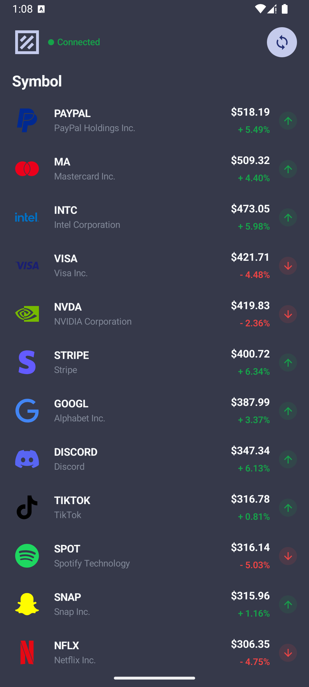
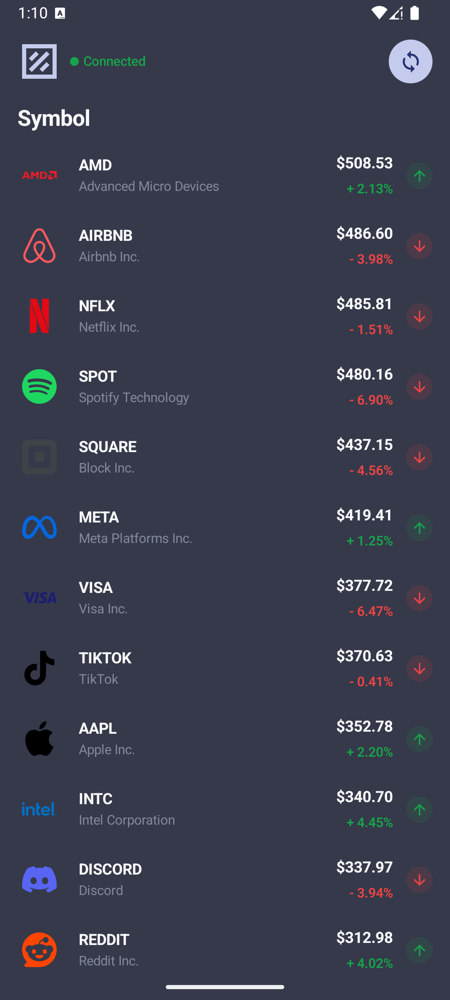
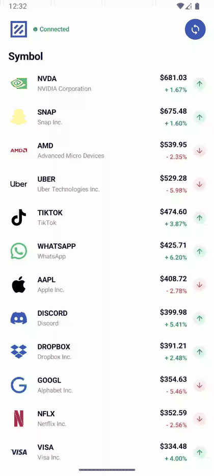
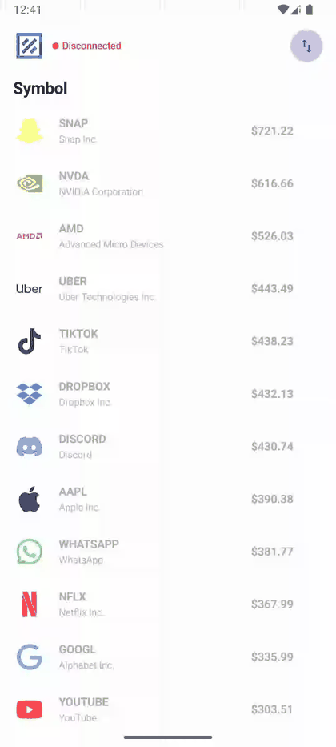
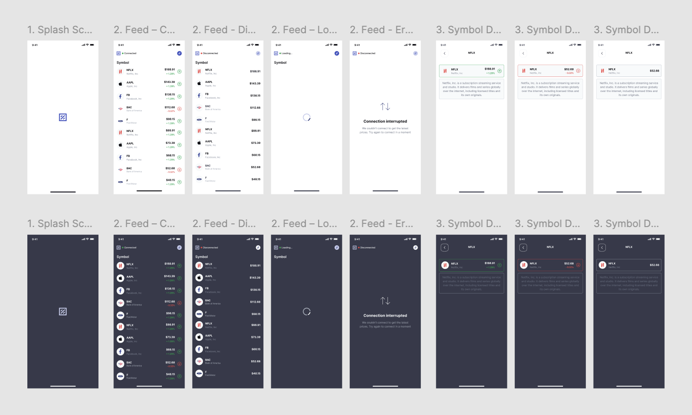

# Pricely

<p align="center">
  
</p>

<p align="center">
  A modular Android stock-tracking app built with Jetpack Compose, real-time price streaming, and a clean feature-based architecture.
</p>

<p align="center">
  <a href="https://www.figma.com/design/A3YhGKJXhtp9o6GwYkOVuy/Pricely?node-id=4-5&t=7OfgDDvOHUFSIZiy-1">Open Figma design</a>
</p>

## Overview
Pricely is an Android application that simulates a live stock feed and turns streaming price updates into a simple, readable market dashboard. The app starts a price session when the main activity is created, keeps the feed alive through a WebSocket-based loop, and maps the session state into a polished Compose UI with loading, error, and connected states.

This project was designed and implemented as a modular Android app with:

- feature-based Gradle modules
- custom convention plugins in `build-logic`
- JVM unit tests and Compose UI tests
- CI automation for static analysis, tests, and release APK generation

## Product Demo
### Main Screen
The screenshots below were captured from verified local `debug` and obfuscated `release` builds.

<p align="center">
  
  
</p>

### Key User Flows
These inline previews were generated from the original screen recordings from Desktop that capture the main product scenarios.

#### Main Flow
<p align="center">
  
</p>

Source video: [main-flow.webm](docs/media/main-flow.webm)

#### Rotation
<p align="center">
  
</p>

Source video: [rotation.webm](docs/media/rotation.webm)

#### Theming
<p align="center">
  
</p>

Source video: [theming.webm](docs/media/theming.webm)

### Build Variants
- `debug`: development build for fast iteration and local debugging
- `release`: minified and obfuscated build with resource shrinking enabled

The release variant is the one validated by CI and exported as an APK artifact.

## Design
The Figma for Pricely was created by me personally, and that is an intentional part of the project story. I wanted the product thinking, interface design, and implementation details to stay aligned from the beginning.

- Figma file: [Pricely design](https://www.figma.com/design/A3YhGKJXhtp9o6GwYkOVuy/Pricely?node-id=4-5&t=7OfgDDvOHUFSIZiy-1)
- Brand mark used in the app and in this README is derived from the real project design-system asset

<p align="center">
  
</p>

## Environment
The project is set up for the following local environment:

- Android Studio: Panda 2 `2025.3.2`
- Java: `17`
- Kotlin: `2.3.20`
- Android Gradle Plugin: `9.0.1`
- compileSdk: `36`
- targetSdk: `36`
- minSdk: `24`

## Architecture
The repository is organized around feature modules and shared core modules instead of a single monolith.

### Modules
- `:app` - application shell, DI entry point, navigation host bootstrap
- `:navigation:api` and `:navigation:internal` - navigation contracts and implementation
- `:core:design-system` - reusable Compose UI components, theme, icons, and branding
- `:core:price-session:api` and `:core:price-session:internal` - session state, domain contracts, ticker, WebSocket logic, and repository implementation
- `:feature:feed:{api,internal,di}` - the main market feed feature
- `:feature:symbol-details:{api,internal,di}` - symbol details screen and feature wiring

### Build Logic
The project uses custom Gradle convention plugins from `build-logic/convention` to keep module setup consistent:

- `pricely.base.android.application`
- `pricely.base.android.library`
- `pricely.base.kotlin.library`
- `pricely.component.compose`
- `pricely.component.koin`
- `pricely.testing.jvm`
- `pricely.testing.android`
- `pricely.config.detekt`

This keeps the module build files small and makes the project structure easier to scale.

## Tech Stack
### Android
- Kotlin
- Jetpack Compose
- Material 3
- Navigation Compose
- AndroidX Lifecycle

### Architecture And Async
- feature-based modularization
- API / internal / DI module split
- Koin for dependency injection
- Coroutines and `StateFlow`

### Networking And Data
- OkHttp
- Kotlinx Serialization
- WebSocket session loop
- Coil 3 with SVG support

### Quality
- Detekt
- Kover
- GitHub Actions
- git hooks

### Testing
- Kotest
- MockK
- Turbine
- kotlinx-coroutines-test
- Compose UI testing
- AndroidX test runner

## Testing Strategy
This project includes both unit tests and UI tests.

### JVM Unit Tests
Unit tests cover core logic, repository behavior, view models, mappers, formatting, and navigation contracts. A few representative examples:

- `core/price-session/internal/src/test/kotlin/dev/kigya/pricely/data/repository/PriceSessionRepositorySpec.kt`
- `feature/feed/internal/src/test/kotlin/dev/kigya/pricely/feature/feed/internal/FeedViewModelSpec.kt`
- `core/price-session/api/src/test/kotlin/dev/kigya/pricely/domain/logic/QuotePriceMathSpec.kt`

### Compose UI Tests
Compose UI tests verify rendering and interaction behavior in the design system and feature screens:

- `core/design-system/src/androidTest/kotlin/dev/kigya/pricely/core/designsystem/DesignSystemComposeTest.kt`
- `feature/feed/internal/src/androidTest/kotlin/dev/kigya/pricely/feature/feed/internal/FeedScreenComposeTest.kt`
- `feature/symbol-details/internal/src/androidTest/kotlin/dev/kigya/pricely/feature/symboldetails/internal/SymbolDetailsScreenComposeTest.kt`

Even though CI no longer runs the emulator-based instrumented workflow, the UI test suite is still part of the codebase and can be executed locally when needed.

## How The Main Screen Works
The main screen logic is intentionally simple and human-readable.

1. When the app starts, `MainActivityViewModel` triggers `StartPriceSessionUseCase`.
2. The session repository seeds an initial quote set, then opens a WebSocket connection.
3. While the stream is connected, a ticker sends price payloads on a schedule.
4. Incoming messages are decoded from JSON.
5. Unknown symbols are ignored.
6. Known symbols are merged into the existing quote map.
7. The merged quotes are sorted and exposed as a new session snapshot.
8. `FeedViewModel` observes that state and maps it into one of three UI states: loading, error, or content.
9. The feed screen renders the list and lets the user pause or resume the stream with one action button.

In plain words: the screen starts with seeded market data, listens for incoming price changes, updates only valid symbols, keeps the list sorted, and always turns the raw session state into something easy to read on screen.

## CI
The main CI pipeline is focused on fast, practical checks:

- `detekt` for static analysis
- `unit-tests` for JVM test coverage and Kover reports
- `release-build` for assembling the obfuscated release APK and publishing it as an artifact

This keeps CI useful for shipping while still documenting that the project also contains local Compose UI tests.

## Git Hooks
The repository contains a project git hook at `.githooks/pre-commit`.

Right now it runs:

```bash
./gradlew detekt
```

Enable the hooks after cloning:

```bash
./gradlew installGitHooks
```

## Getting Started
### Clone And Setup
```bash
git clone <your-repository-url>
cd price-tracker
./gradlew installGitHooks
```

### Run Debug Build
```bash
./gradlew :app:assembleDebug
```

### Run Release Build
```bash
./gradlew :app:assembleRelease
```

### Run Unit Tests
```bash
./gradlew test
```

### Run Compose UI Tests Locally
```bash
./gradlew :core:design-system:connectedDebugAndroidTest :feature:feed:internal:connectedDebugAndroidTest :feature:symbol-details:internal:connectedDebugAndroidTest
```

## Notes
- The release build is configured with minification, obfuscation, and resource shrinking.
- Both `debug` and `release` variants were built locally and launched successfully during verification.
- The release APK is suitable for CI artifact publishing.
